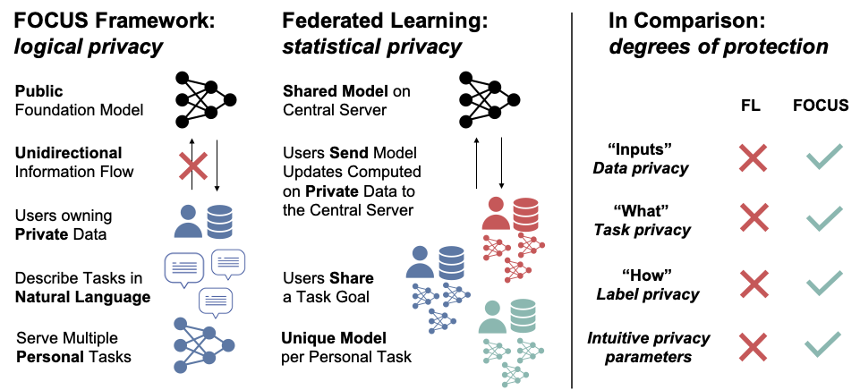

# Can Foundation Models Help Us Achieve Perfect Secrecy?

This repository contains resources for FOCUS, a privacy framework for serving personal machine learning tasks. We include scripts to download data and evaluate foundation models of various sizes and types across popular privacy benchmarks from the federated learning literature. Additional information can be found in the paper: https://arxiv.org/abs/2205.13722.

<p align="center"></p>

## Setup

Use the following commands to clone and install this package. We highly recommend you use conda environments.

```
# environment
conda create -n py37 python=3.7
conda activate py37

# installations
git clone git@github.com:simran-arora/focus.git
cd focus
pip install -e .
pip3 install torch torchvision torchaudio --extra-index-url https://download.pytorch.org/whl/cu113

cd benchmarks/leaf
git submodule init
git submodule update
```

If you want to run inference with the API models, first obtain your OpenAI inference API key here [OpenAI API](https://openai.com/api/). Then set the environment variables:
```
export OPENAI_API_KEY="<YOUR API KEY>"
```

## Obtain the datasets

Download benchmark datasets to the ``focus/benchmarks/'' directory
```
cd benchmarks/
bash download_data.sh
```

The LEAF Federated Learning benchmark suite provides: Sent140, Reddit, FEMNIST, and CELEB-A. The FedNLP suite provides 20News and MRQA. The FedML suite provides CIFAR-10.
- Sent140, FEMNIST, CelebA, CIFAR-10, and 20News benchmarks are downloaded via the provided download script. 
- [Reddit] Go to benchmarks/leaf/data/reddit/ and follow the download instructions.
- [MRQA] Go to https://github.com/FedML-AI/FedNLP/tree/27f3f97c72e7f206f8937fe6bcbba39ce79fbcd6/data/raw_data_loader/MRQA and run ``python download.py`` using their provided script.

## Run the code

The ``focus/scripts/`` directory provides scripts to run experiments for each benchmark.

For example:
```
bash scripts/cifar.sh
bash scripts/sent140.sh
```

We include examples for running inference with the API in the script files. Note that this requires providing the ```openai_key``` command line argument.

## Citation
Please use the following Bibtex for this work:
```
@misc{arora2022focus,
      title={Can Foundation Models Help Us Achieve Perfect Secrecy?}, 
      author={Simran Arora and Christopher Ré},
      year={2022},
      url={https://arxiv.org/abs/2205.13722},
      journal={arXiv:2205.13722},
      primaryClass={cs.LG}
}
```

We welcome contributions and feel free to reach out at [simarora@stanford.edu](simarora@stanford.edu).
